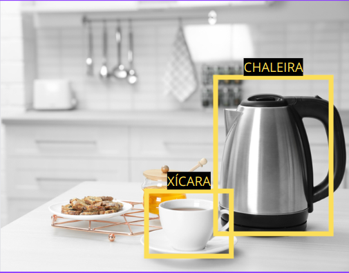

# Neural network for brewing coffee

Para criar uma rede neural capaz de guiar o processo de fazer café com base na identificação de objetos na cozinha, é necessário definir os passos do processo a serem seguidos. Aqui está uma descrição do fluxo:

### Passos do Processo:

1. **Identificação dos Objetos:**
   - A rede neural utilizará visão computacional para identificar objetos-chave na cozinha, como chaleira, torneira, xícara, copo e café.
     

  
  

2. **Localizar a Chaleira:**
   - A partir da identificação da chaleira, a rede neural orienta a movimentação em direção à chaleira na cozinha.

3. **Colocar Água na Chaleira:**
   - A rede neural instrui sobre como colocar a quantidade adequada de água na chaleira.

4. **Ligar o fogão p/ ferver a água:**
   - A rede neural orienta sobre como ligar o fogão p/ ferver a água e coloca um timer de tempo estimado p/ a água ferver ou identificar através de visão computacional que está fervendo.

5. **Localizar o Café e o Filtro:**
   - A rede neural ajuda a encontrar onde está o pó de café e o filtro.

6. **Preparar o Café:**
   - Com base na quantidade de café e água disponível, a rede neural orienta a colocar o café no filtro.

7. **Identificar a Xícara ou Copo:**
   - Com base na disponibilidade, a rede neural ajuda a localizar a xícara ou copo para servir o café.

8. **Transferir o Café Pronto:**
   - A rede neural fornece instruções sobre a quantidade de café já coado a ser servido no copo/xícara.

9. **Finalização:**
    - A rede neural concluiu o preparo e serviu o café!

Esses passos são fundamentais para que a rede neural possa orientar o processo de fazer café de forma autônoma.

## Considerações Adicionais

### Desenvolvimento e Treinamento da Rede Neural:

Para implementar essa rede neural, serão necessários dados de treinamento contendo diferentes cenários de cozinhas e objetos. Além disso, um treinamento robusto com uma quantidade significativa de dados é essencial para garantir a precisão na identificação dos objetos e na orientação do processo de fazer café.

- Como conectar o META-QUEST pro (oculus vr) com um dispositivo externo p/ rodar o script .py dentro da simulação p/ trackear e identificar os objetos?

- Como identificar a mão do jogador p/ pegar objetos no ambiente simulado?  (https://www.youtube.com/watch?v=Yveg_dqBs34&ab_channel=TricksTipsFix)

- Como transpor o passo-a-passo na tela do VR identificando cada etapa já feita? Como identificar que a chaleira está cheia de água (metálica)? Identificar o ponto de fervura por turbulência na água ou timer? Os objetos estarão a vista ou dentro de armários/gavetas?

- Object tracking on VR (ele está pegando o Casting from the Quest Pro to a pc, running object detection on the pc screen, then sending the results back to the quest pro), aparentemente não é possível ter acesso direto a camera - https://twitter.com/ConcreteSciFi/status/1691448787821375489 // https://www.youtube.com/watch?v=bsVRoffcqJA&ab_channel=ZackQattan

- AR/VR Guide (https://github.com/mikeroyal/AR-VR-Guide)

### Personalização do Guia de Preparo:

A rede neural pode ser projetada para permitir personalizações para atender às necessidades individuais dos usuários, como café sem açucar, mais amargo, mais fraco, etc..

